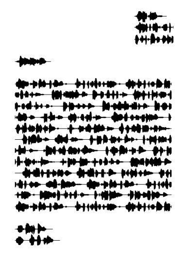

# Cantwell
Visual sound waves letters generator.

## Why?
First, couldn't sleep.

Then, I was inspired by this image:


I thus decided to do my own version, but with arbitrarily inputs.

[More on the original art!](#more-infos)

## What?
Basically, you will enter text that will be converted into a PDF file containing the soundwaves of the text.

The result looks a bit like:



You can get the previous example by running `soundletter.py -e`.

## How?
### Prerequisites and installation
- `git clone git@github.com:Amustache/Cantwell.git`
- `pip install -Ur ./reqs.txt`
- You may encounter some librairies issues, just install what is needed.
    - e.g., `sudo apt install ffmpeg -y`
    - Feel free to open an issue so I can document what to install!
  
Important! This project is using [gTTS](https://gtts.readthedocs.io/en/latest/), "Google Text-to-Speech". As the name hints, some data are sent to Google, so... Data is exchanged with Google. Use at your discretion.

### Usage
```
usage: soundletter.py [-h] [-e | -f FILE | -i] [-v]

Generate a little sound letter.

optional arguments:
  -h, --help            show this help message and exit
  -e, --example         Generate an example letter.
  -f FILE, --file FILE  Use a JSON file for generation.
  -i, --interactive     Create a letter in the command line!
  -v, --verbatim        State what the program is doing.
```

#### JSon file
If you wish to use a custom file, here is the format:

```
{
    "unique_identifier1": {
        "text": "What is the text to write?",
        "offset": 1800,
        "limit": 50000,
        "cut": 1
    },
    "unique_identifier2": {
        "text": "",
        "offset": 0,
        "limit": 0,
        "cut": 1
    },
    "unique_identifier3": {
        "text": "Another text to write!",
        "offset": 200,
        "limit": 200000,
        "cut": 1
    },
    ...
}
```

- Each entry is roughly a single line, and shall have a unique identifier.
- `text` is pretty explicit. It can be the length that you want.
    - If `text` is empty, it will simply be considered as a new line.
- `offset` is the offset in regards to the left of the page.
    - For instance, you can use `1800` for the top-right address.
    - For instance, you can use `200` for a little margin for a normal text.
- `limit` is the size to use before truncating the signal.
    - For instance, you can use `50000` for the top-right address.
    - For instance, you can use `200000` for a text that should be full-length.
- `cut` is whether the text should be truncated if too long, or if it shall rather use carriage return.
    - Put `1` to savagely butcher your signal, `0` to still savagely butcher it but without throwing the rest away.

## More infos!
### Context
For a bit of context, the original picture has been shared on [Telegram](https://t.me/paspublique/12345), and a discussion emerged in [another channel](https://t.me/ChaoticEvilMobster/2799).

After I wanted to recreate the thing with a little bit of code, user [@Moose0x5a](https://t.me/Moose0x5a) did some research:

> Literally cant get over this.
> 
> I've spent the last 45 minutes digging on this and sifting through garbage pinterest links and half-cocked sources just to find the artists website from ages back. Ended up following some leads from their website using the wayback machine and found that this piece is from an exhibition called "Birdsong," which then led me to their freesound that they allowed people to download the sounds played specifically from each birdhouse which led me to Flickr. The image was uploaded to Flicker in 2011, from there I've found her new website. The name change didnt help finding the source. as far as I can tell, the author didn't include any translation of what it said. Maybe its personal.
> 
> But then again there's only one way to find out truly, so I suppose I'll send her an email and hope she responds, unsure if she still operates as an artist but its worth a shot. (Edit: Seems the email that is being used for the shoutbox is to another domain, might not work Had the wrong TLD on the website)
> 
> Birdsong: https://www.flickr.com/photos/jencantwell/albums/72157628722284255
> 
> Same title but different content: https://jenfrankwell.ink/wp-content/uploads/2018/10/letter-home-scaled-e1595187356548.jpg
> 
> New website: https://jenfrankwell.ink/

After sending a message to the artist, here's her reply!

> Thanks so much for getting in touch and well done on tracking me down.  That's a piece of mine from 2010 I think, it keeps popping up on the internet, the change in image is because one image is the image of the actual printed piece from the show,  I made it as a last minute add-on because I had a few extra quid in the printing budget, I had no time and literally had to chuck it together in an hour, so later I went back and spent more time with it and made it more what I wanted it to be which is the first Digital image. 
> 
> So provenance on it has been complicated by me using Frankwell as my art name instead of Cantwell which is my actual name and the name I made it under. Cantwell was heavily associated with my practice as a designer-maker and I wanted  to separate my practices, so on the spur of the moment I decided I wanted a name that was truly mine,  not one that was someone else’s,  not realising that I was making my life WAY more complicated!
> 
> My favourite bird is the blackbird. The recording is of a blackbird in my garden in the north of Scotland. The idea of the piece is that it's a letter home from a migrated bird, telling the family of its new life and making the connection between the migrant and the homeland. I’m an immigrant, I was raised here since I was 6 and the strange belonging/not belonging aspect of being a migrant has been one of the defining themes of my lifetime, it took me a long time to understand it and this is one of the times its surfaced in my art.
> 
> Don't apologise for asking questions, I’m very touched that you were moved enough to find me. The real art lies in the interaction between you as the viewer and the piece of work, its not so much about the piece of work, its about the energy between the thing and the person, its a third quantity if that makes any sense, like completing a circuit or mixing two colours to get a new one. 
> 
> You've made my day, thankyou.
> 
> Jen

### Result


You can see the resulting artwork here: <https://stache.cat/2021/12/24/sound-letters-wall/>
